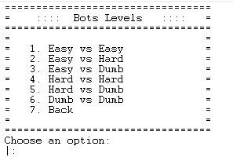
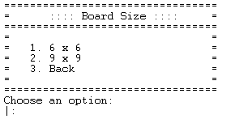
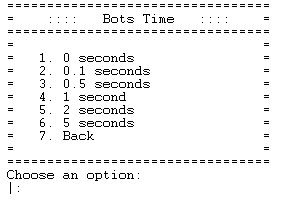

# Greener

This is a Prolog implementation of the game [Greener](https://nestorgames.com/#green_detail), a capturing game for 2 players, where both must capture the same colour.
This implementation is made by the group Greener_5 that consists of

- João Renato da Costa Pinto (up201705547)
- Tiago Gonçalves Gomes (up201806658)

## How to run the game

1. In SICStus Prolog, consult the file 'play.pl' in the src directory(File -> Consult... -> src/play.pl; or in the sicstus terminal: `[play].`), and the game will start automatically.

## Game Rules

**Definitions:**

- A stack is either  one pyramid or several pyramids stacked on top of each other.
- A stack is controlled by the colour of the topmost pyramid. So a ‘Black’ stack is a stack of any height with a black pyramid on top, and so on...

**Rules:**

- The game is made for 2 players (Black and White players)
- The board size is **6x6** or **9x9**
- There are **9 Black Pyramids, 9 White and 18 Green for the 6x6 board** or **20 Black,20 White and 41 Green for the 9x9 one**
- The pyramids are randomly placed in the board (1 per cell)
- Each player has an allocated colour (Black or White), while green is neutral
- Black always starts and players alternate turns during the game until both players pass in succession
- On your turn you **must** make one capture if possible, otherwise you **pass** the turn
- Stacks capture other stacks that are on the same row or column and with no other stacks in between them; stacks cannot be split
- The player can capture stacks of any colour (even his own pieces)
- The game ends when both players pass in succession and wins the player with the most green pyramids captured (being part of stacks they control)
- In case of a tie, the player with the highest stack wins, if the tie persists, the players need to play again

[**Rule Book**](https://nestorgames.com/rulebooks/GREENGREENERGREENEST_EN.pdf)

## Menus

Our Main Menu is composed by the Play option which leads to Game Mode Menu, the How to Play option which gives the Rules to the player and a EXIT option.


### Game Modes

Our implementation of Greener currently has 3 main modes: PvP (Player vs Player), PvCPU (Player vs Computer) and CPUvsCPU (Computer vs Computer). The bots have 3 levels of difficulty: an Easy mode, a Hard mode and a Dumb one.

In the Computer vs Computer mode, the player can select all different combinations of bots difficulty: Easy vs Easy, Easy vs Hard, Easy vs Dumb, Hard vs Hard, Hard vs Dumb and Dumb vs Dumb.

 



### Board Size Menu

After the game mode selection, we go to the Board Size Menu, where we can choose between 6x6 or 9x9 boards.



### Bot Time Menu

For demonstration proposes, or fast game experiences, we also implemented different sleep times for the bots. The player can choose between 0, 0.1, 0.5, 1, 2 or 5 seconds of sleep.



### Play Again

After a game ends, we show a menu where we invite the player to play again or to exit.


## Game Logic Implementation

### Game State Representation

The board is represented by a list of lists of lists, where the latest is the representation of a stack of pieces. Each piece colour has an associated number(0 for white, 1 for black and 2 for green; 3 for no piece in the cell). The player turn is also represented by a number, similar to the pieces, 0 for white and 1 for black.
 Since the pieces are always in the board there is no more information to be kept.
 Examples of game states in Prolog for 6x6 :

- Initial State

	[	[[2],[0],[2],[1],[0],[2]],</br>
		[[0],[0],[2],[1],[2],[0]],</br>
		[[1],[1],[2],[1],[2],[2]],</br>
		[[1],[2],[2],[2],[0],[2]],</br>
		[[1],[0],[2],[1],[2],[2]],</br>
		[[1],[0],[2],[2],[0],[2]]	] , 1

- Intermediate State

	[	[[1,1,0],[3],[3],[2],[0],[2]],</br>
		[[0],[0],[2],[1],[2],[0]],</br>
		[[1],[1],[2],[1],[2],[2]],</br>
		[[1,2,2,2],[3],[3],[3],[0],[2]],</br>
		[[2],[0],[2],[1],[2],[2]],</br>
		[[1],[0],[2],[2],[0],[2]]	] , 0

- Final State

	[	[[1,1,0,2,0,2],[3],[3],[3],[3],[3]],</br>
		[[3],[3],[3],[1,2,0,0,2,0],[3],[3]],</br>
		[[3],[1,1,2,1,2,2],[3],[3],[3],[3]],</br>
		[[3],[3], [1,2,2,2,2,0,2],[3],[3],[3]],</br>
		[[3],[3],[3],[3],[3],[1,2,2,2,0]],</br>
		[[3],[3],[3],[3],[0,2,2,2,0,1],[3]]	] , 0


### Game State Visualization

We print a board on screen with letters and numbers to indicate position, and in each cell we represent the color of the head of the list (piece on top of the stack ['W','B','G'], or no piece [  ]) and next to it a number that represents the score associated with the stack (number of green pieces in the stack).

For making the translation between the letters and numbers that are shown to the user and their real implementation, we make use of the `translate/2` predicate:

```prolog
translate(0, ' W '). % white pyramid
translate(1, ' B '). % black pyramid
translate(2, ' G '). % green pyramid
translate(3, '   '). % no piece
```

Note: we represent an empty cell with [3] rather than an empty list, because that way it's easier for us to use the `translate/2` predicate.

</br>

**Examples for 6x6 boards:**

#### Initial State


#### Intermediate State


#### Final State


**Example for 9x9:**

#### Final State 9x9


### Valid Moves List

To find all valid moves, we use our ``valid_moves/4`` predicate which, given the board state and size, and the current player, give us a list ``AllMoves`` with all possible moves (each move has the template [RowFrom, ColumnFrom, RowTo, ColumnTo]).

For that, we use ``findall/3`` with all the conditions that validate a move:
- the player is moving one if his/hers stacks
- the chosen stack can capture others
- the move is made orthogonally
- there are no stacks in between the start and the end positions
- the final position has a stack to be captured (is not empty)

```prolog
valid_moves(Board,Player,AllMoves,Size):-
	findall(
        [RowFrom, ColumnFrom, RowTo, ColumnTo],
        (
            getRandomMove(RowFrom, ColumnFrom, RowTo, ColumnTo,Size),
			getPieceByRowAndColumn(Board, RowFrom, ColumnFrom, Piece),
   	 		Piece = Player, % verifica se a stack pertence ao jogador atual
			\+ checkIfStackCannotCapture(Board, RowFrom, ColumnFrom), % verifica se a stack pode capturar outras stacks
			checkOrthogonality(RowFrom, ColumnFrom, RowTo, ColumnTo), % verifica se o movimento é feito ortogonalmente
			checkStacksBetween(Board, RowFrom, ColumnFrom, RowTo, ColumnTo), % verifica se existem stacks entre a posição inicial e final
			\+ checkEmptyCell(Board, RowTo, ColumnTo) % verifica se a posição final tem alguma peça para ser capturada
		),
    	AllMoves
	).
```

### Move Validation and Execution

When it's not a bot to make a move, we first ask the player for a start and end positions,
until the player enters valid ones.

```prolog
askMove(Board, Player, RowStart, ColumnStart, RowEnd, ColumnEnd, Size):-
	nl,write('========================================'),nl,
	askForPiecePosFrom(Board, Player, RowStart, ColumnStart, Size),nl,
	askForPiecePosTo(Board, RowStart, ColumnStart, RowEnd, ColumnEnd, Size),
	nl,nl,write('========================================'),nl,nl.
```

First, we ask a start position, and check if the corresponding cell has a stack controlled by the player and if that stack can capture other stacks. If some condition fails, we ask for other position, until all the conditions are met.

```prolog
askForPiecePosFrom(Board, Player, Row, Column, Size):-
	repeat,
	(
		askForPosition(Row, Column, 'Which stack do you want to move?', Size),
		getPieceByRowAndColumn(Board, Row, Column, Piece),
		(
			Piece = Player, % verifica se a stack que o jogador quer mover lhe pertence
			\+ checkIfStackCannotCapture(Board, Row, Column),!
		);
		nl,nl,write('You cannot move that stack!\nPlease choose another one!'),nl,nl,fail
	).
```

Then, we ask for the final position, and check the following conditions: the move is made orthogonally, there are no stacks in between the start and the end positions and the final position has a stack to be captured (is not empty).

```prolog	
askForPiecePosTo(Board, RowFrom, ColumnFrom, RowTo, ColumnTo, Size):-
	repeat,
	askForPosition(RowTo, ColumnTo, 'For which position do you want to move it?', Size),
	(
		(
			checkOrthogonality(RowFrom, ColumnFrom, RowTo, ColumnTo), % verifica se o movimento é feito ortogonalmente
			checkStacksBetween(Board, RowFrom, ColumnFrom, RowTo, ColumnTo), % verifica se existem stacks entre a posição inicial e final
			\+ checkEmptyCell(Board, RowTo, ColumnTo),! % verifica se a posição final tem alguma peça para ser capturada
		);
		nl,nl,write('This movement is not a valid one!\nPlease choose another final position!'),nl,nl,fail
	).
```

To move a piece to another cell of the board, after its validation is done, we use our ``move/6`` predicate, that moves the stack of the origin cell to the destination cell and appends to it the stack that was previously there, clearing the origin cell.

```prolog
move(Board, NewBoad, RowStart, ColumnStart, RowEnd, ColumnEnd):-
	getStackByRowAndColumn(Board, RowStart, ColumnStart, StackStart),
	append_stack(Board, RowEnd, ColumnEnd, StackStart, NewBoad0),
	clear_cell(NewBoad0, RowStart, ColumnStart, NewBoad).
```

### Game Ending

The game **ends after both players pass the turn successively**, which we check in every game loop. For that, the ``game_over/3`` predicate is called in every game loop, and succeeds if the succession number is 2. The succession number is set to 0 in the game loop every time a player makes a move (don't pass the turn). If the player needs to pass the turn, the succession number is increased by 1. So, when the two players pass in succession, the succession number is 2, and the game ends. After the game ends, we find who is the winner of the game, and print it on the screen.

```prolog
game_over(GameState, Succession, Size):- 
	Succession = 2,
    display_game(GameState, 2, Size), % Player é 2, para não fazer display do player atual, já que ninguém é a jogar
    nl,nl,nl,write('Game Over!'),nl,nl,nl,
    checkWinner(GameState,Size).
```

The player who has the highest number of green pyramids in the stacks controlled by him/she wins the game. If both players have the same score, wins the player with the highest stack. If the tie persists, nobody wins, and the players need to play again to find a winner.

```prolog
checkWinner(Board, Size):-
	value(Board, 0, WhitePoints, Size),
	value(Board, 1, BlackPoints, Size),
	write('========================================'),nl,nl,
	nl,nl,write('--> Final Score:'),nl,nl,
	write('Black Player: '), write(BlackPoints), write(' points.'),nl,nl,
	write('White Player: '), write(WhitePoints), write(' points.'),nl,nl,
	(
		WhitePoints > BlackPoints -> nl,nl,write('White Player won!'),nl,nl,nl;
		(
			BlackPoints > WhitePoints -> nl,nl,write('Black Player won!'),nl,nl,nl;
            getHighestStackHeight(GameState, 0, HeightWhite),
            getHighestStackHeight(GameState, 1, HeightBlack),
            (
                HeightWhite > HeightBlack -> (
                    nl,nl,write('White Player won, because he has de highest stack!'),nl,nl,nl
                );
                (
                    HeightBlack > HeightWhite -> (
                        nl,nl,write('Black Player won, because he has de highest stack!'),nl,nl,nl
                    );
                    (
                        nl,nl,write('It was a tie! You have the same number of points and the same highest stack height! Please play again!'),nl,nl,nl
                    )
                    
                )
            )
		)
	).
```

### Board Evaluation

To evaluate the state of the game, this is, to find how many points each player has, we use the `value/4` predicate, which receives the board state and size, and the player, and gives the number of green pyramids in the stacks controlled by the player. Besides counting the final scores of the players, this predicate is fundamental for the hard and dumb bots, since these bots are checking which are the best or worst moves, as we will explain in the next section.

```prolog
value(Board, Player, Points,Size):-
	value(Board, Player, Points, 0, Size).
value(_, _, Points, Points, 0).
value(Board, Player, N, Points, Row):-
	Row > 0,
	Row1 is Row - 1,
	nth0(Row1, Board, RowList),
	countRowPoints(Player, RowList, Counter), % conta o número de pontos de um dado jogador, numa linha
	Points1 is Points + Counter,
	value(Board, Player, N, Points1, Row1).

countRowPoints(Player, RowList, Counter):-
	countRowPoints(Player, RowList, Counter, 0).
countRowPoints(_, [], Counter, Counter).
countRowPoints(Player, [[H|T0]|T], C, Counter):-
	(
		H = Player -> (
            occurrences_of([H|T0],2,Counter0), % conta o número de peças verdes que a stack tem
            Counter1 is Counter + Counter0
        );
		Counter1 is Counter
	),
	countRowPoints(Player, T, C, Counter1).
```

### Bots Moves

To choose the difficulty of the bots, to be as the player have chosen, we use the ``choose_move/8`` predicate.

```prolog
choose_move(GameState,Player,Level,RowStart, ColumnStart, RowEnd, ColumnEnd, Size):-
	(
		Level = 'Easy' -> getMoveEasy(GameState, Player, RowStart, ColumnStart, RowEnd, ColumnEnd, Size);
		Level = 'Hard' -> getMoveHard(GameState, Player, RowStart, ColumnStart, RowEnd, ColumnEnd, Size);
		Level = 'Dumb' -> getMoveDumb(GameState, Player, RowStart, ColumnStart, RowEnd, ColumnEnd, Size)
	).
```

For the Easy bot, we use the ``getMoveEasy/7`` predicate, which finds all the valid moves at the moment and picks a random one.

```prolog
getMoveEasy(GameState, Player, RowStart, ColumnStart, RowEnd, ColumnEnd, Size):-
	valid_moves(GameState, Player, AllMoves,Size),
	random_member(Move,AllMoves),
	nth0(0,Move,RowStart),
	nth0(1,Move,ColumnStart),
	nth0(2,Move,RowEnd),
	nth0(3,Move,ColumnEnd).
```

For the Hard bot, we use the ``getMoveHard/7`` predicate, which finds all the valid moves at the moment and picks the move that will provide the highest score increase. 

```prolog
getMoveHard(GameState, Player, RowStart, ColumnStart, RowEnd, ColumnEnd,Size):-
	valid_moves(GameState, Player, AllMoves, Size),
	addScoreToMoves(GameState, Player, AllMoves, AllMovesWithScore,Size),
	sort(AllMovesWithScore,AllMovesWithScoreSorted0),
	reverse(AllMovesWithScoreSorted0,AllMovesWithScoreSorted),
	nth0(0,AllMovesWithScoreSorted,MoveWithScore),
	nth0(1,MoveWithScore,Move),
	nth0(0,Move,RowStart),
	nth0(1,Move,ColumnStart),
	nth0(2,Move,RowEnd),
	nth0(3,Move,ColumnEnd).
```

For that, we add the corresponding score to each movement, as follows:

```prolog
addMoveScore(GameState, Player, Move, MoveWithScore, Size):-
	value(GameState, Player, PointsBefore, Size),
	nth0(0,Move,RowStart),
	nth0(1,Move,ColumnStart),
	nth0(2,Move,RowEnd),
	nth0(3,Move,ColumnEnd),
	move(GameState, NewGameState, RowStart, ColumnStart, RowEnd, ColumnEnd),
	value(NewGameState, Player, PointsAfter, Size),
	MoveScore is PointsAfter - PointsBefore,
	MoveWithScore = [MoveScore,Move].

addScoreToMoves(GameState,Player,AllMoves,AllMovesWithScore,Size):-
	addScoreToMoves(GameState,Player,AllMoves,AllMovesWithScore,[],Size).
addScoreToMoves(_,_,[],AllMovesWithScore,AllMovesWithScore,_).
addScoreToMoves(GameState,Player,[Move|T],M,AllMovesWithScore,Size):-
	addMoveScore(GameState,Player,Move,MoveWithScore,Size),
	addScoreToMoves(GameState,Player,T,M,[MoveWithScore|AllMovesWithScore],Size).
```

Then, we sort the list of pairs by score in descending order (``sort/2`` + ``reverse/2``), and the best move is in the first position of that list.

</br>

For the Dumb bot, we use the ``getMoveDumb/7`` predicate, which finds all the valid moves at the moment and picks the move that will provide the smallest score increase. The only difference to the Hard bot is that the Dumb sorts the list of pairs Score-Move in ascending order.

```prolog
getMoveDumb(GameState, Player, RowStart, ColumnStart, RowEnd, ColumnEnd,Size):-
	valid_moves(GameState, Player, AllMoves, Size),
	addScoreToMoves(GameState, Player, AllMoves, AllMovesWithScore,Size),
	sort(AllMovesWithScore,AllMovesWithScoreSorted),
	nth0(0,AllMovesWithScoreSorted,MoveWithScore),
	nth0(1,MoveWithScore,Move),
	nth0(0,Move,RowStart),
	nth0(1,Move,ColumnStart),
	nth0(2,Move,RowEnd),
	nth0(3,Move,ColumnEnd).
```

## Conclusion

The development of this game was very interesting for us. At first, it was a very bumpy ride, where we had doubts about pretty much every single feature we tried to add, because we are both new to Logic Programming paradigm. However, we actually started to enjoy it, and we got to learn a lot of different things, as well as getting an introduction to Artificial intelligence, another very interesting subject.
Overall it was a very fun experience with a lot of learning involved!

## Known Issues

There are **no known issues** for the game at this time!

## RoadMap

For future improvements of the game, enhancing the AI of the bots is the way, trying to look for the subsequent plays and scoring them, searching for the most efficient plays rather than only analyzing the immediate play.

## Work Distribution:
- João Renato da Costa Pinto: 35%
- Tiago Gonçalves Gomes: 65%

## Bibliography

* [Sicstus Manual](https://sicstus.sics.se/sicstus/docs/latest4/html/sicstus.html/)
