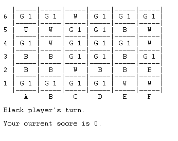

# Greener

This is a Prolog implementation of the game [Greener](https://nestorgames.com/#green_detail), a capturing game for 2 players, where both must capture the same colour.
This implementation is made by the group Greener_5 that consists of

- João Renato da Costa Pinto (up201705547)
- Tiago Gonçalves Gomes (up201806658)

## How to run the game

1. In SICStus Prolog, consult the file 'play.pl' in the src directory(File -> Consult... -> src/play.pl; or in the sicstus terminal: `[play].`), and the game will start automatically.

## Game Rules

**Definitions:**

- A stack is either  one pyramid or several pyramids stacked on top of each other.
- A stack is controlled by the colour of the topmost pyramid. So a ‘Black’ stack is a stack of any height with a black pyramid on top, and so on...

**Rules:**

- The game is made for 2 players (Black and White players)
- The board size is **6x6** or **9x9**
- There are **9 Black Pyramids, 9 White and 18 Green for the 6x6 board** or **20 Black,20 White and 41 Green for the 9x9 one**
- The pyramids are randomly placed in the board (1 per cell)
- Each player has an allocated colour (Black or White), while green is neutral
- Black always starts and players alternate turns during the game until both players pass in succession
- On your turn you **must** make one capture if possible, otherwise you **pass** the turn
- Stacks capture other stacks that are on the same row or column and with no other stacks in between them; stacks cannot be split
- The player can capture stacks of any colour (even his own pieces)
- The game ends when both players pass in succession and wins the player with the most green pyramids captured (being part of stacks they control)
- In case of a tie, the player with the highest stack wins, if the tie persists, the players need to play again

[**Rule Book**](https://nestorgames.com/rulebooks/GREENGREENERGREENEST_EN.pdf)

## Menus

Our Main Menu is composed by the Play option which leads to Game Mode Menu, the How to Play option which gives the Rules to the player and a EXIT option.


### Game Modes

Our implementation of Greener currently has PvP, PvCPU and CPUvsCPU, where the bots have 3 levels of difficulty, the easy mode, a hard mode and the dumb mode.
If Computer vs Computer, the player can select all different combinations of bots difficulty, (easy Vs easy, Hard vs Hard, Hard vs Dumb, etc...)
After player type selection, we go to the board Size Menu Where we can choose between 6x6 or 9x9 boards.
For demonstration proposes, or fast game experiences, we also implemented different sleep times for the bots,the player can choose between 0, 0.1 , 0.5, 1, 2 or 5 seconds of sleep.

 


### Play Again

After agame ends we show a menu where we invite the player to play again or to exit


## Game Logic Implementation

### Game State Representation

The board is represented by a list of lists of lists, where the latest is the representation of a stack of pieces. Each piece colour has and associated number(0 for white, 1 for black and 2 for green; 3 for no piece in the cell). The player turn is also represented by a number, similar to the pieces, 0 for white and 1 for black.
 Since the pieces are always in the board there is no more information to be kept.
 Examples of game states in Prolog for 6x6 :

- Initial State

	[	[[2],[0],[2],[1],[0],[2]],</br>
		[[0],[0],[2],[1],[2],[0]],</br>
		[[1],[1],[2],[1],[2],[2]],</br>
		[[1],[2],[2],[2],[0],[2]],</br>
		[[1],[0],[2],[1],[2],[2]],</br>
		[[1],[0],[2],[2],[0],[2]]	] , 1

- Intermediate State

	[	[[1,1,0],[3],[3],[2],[0],[2]],</br>
		[[0],[0],[2],[1],[2],[0]],</br>
		[[1],[1],[2],[1],[2],[2]],</br>
		[[1,2,2,2],[3],[3],[3],[0],[2]],</br>
		[[2],[0],[2],[1],[2],[2]],</br>
		[[1],[0],[2],[2],[0],[2]]	] , 0

- Final State

	[	[[1,1,0,2,0,2],[3],[3],[3],[3],[3]],</br>
		[[3],[3],[3],[1,2,0,0,2,0],[3],[3]],</br>
		[[3],[1,1,2,1,2,2],[3],[3],[3],[3]],</br>
		[[3],[3], [1,2,2,2,2,0,2],[3],[3],[3]],</br>
		[[3],[3],[3],[3],[3],[1,2,2,2,0]],</br>
		[[3],[3],[3],[3],[0,2,2,2,0,1],[3]]	] , 0

### Game State Visualization

We print a board on screen with letters and numbers to indicate position, and in each cell we represent the color of the head of the list (piece on top of the stack ['W','B','G'], or no piece [  ]) and next to it a number that represents the score associated with the stack ( number of green pieces in the stack)

```prolog
translate(0, ' W '). % white pyramid
translate(1, ' B '). % black pyramid
translate(2, ' G '). % green pyramid
translate(3, '   '). % no piece
```

Examples for 6x6 boards:

#### Initial State



#### Intermediate State


#### Final State


Example for 9x9:

#### Final State 9x9


### Valid Moves List

When a bot is playing we get all the possible moves, with our **valid_moves** predicate that uses the findall/3 predicate of Prolog with a template of  [RowFrom, ColumnFrom, RowTo, ColumnTo] and getting a random move that is a valid move,in other words, where the cell selected has a stack controlled by the current player, if that stack can capture other stacks, if the move is orthogonal and there are no other stacks in between the selected stack and the destination, and if the destination is not a empty cell.

```prolog
valid_moves(Board,Player,AllMoves,Size):-
	findall(
        [RowFrom, ColumnFrom, RowTo, ColumnTo],
        (
            getRandomMove(RowFrom, ColumnFrom, RowTo, ColumnTo,Size),
			getPieceByRowAndColumn(Board, RowFrom, ColumnFrom, Piece),
   	 		Piece = Player, % verifica se a stack pertence ao jogador atual
			\+ checkIfStackCannotCapture(Board, RowFrom, ColumnFrom), % verifica se a stack pode capturar outras stacks
			checkOrthogonality(RowFrom, ColumnFrom, RowTo, ColumnTo), % verifica se o movimento é feito ortogonalmente
			checkStacksBetween(Board, RowFrom, ColumnFrom, RowTo, ColumnTo), % verifica se existem stacks entre a posição inicial e final
			\+ checkEmptyCell(Board, RowTo, ColumnTo) % verifica se a posição final tem alguma peça para ser capturada
		),
    	AllMoves
	).
```

### Move Validation

After checking if the current player has any move available, if not, the **turn automatically passes**, if available, we ask the player to select a Piece to move, after that we check if that stack is controlled by the current player and if it has any available moves, if so, we require a destination stack to the player where again we check if the move is valid( if that stack can capture other stacks, if the move is orthogonal and there are no other stacks in between the selected stack and the destination, and if the destination is not a empty cell).

### Move Execution

To move a piece to another cell of the board, after its validation, done  we use our **move** predicate, that moves the stack of the origin cell to the destination cell and appends to it the stack that was previously there, clearing the origin cell.

```prolog
move(Board, NewBoad, RowStart, ColumnStart, RowEnd, ColumnEnd):-
	getStackByRowAndColumn(Board, RowStart, ColumnStart, StackStart),
	append_stack(Board, RowEnd, ColumnEnd, StackStart, NewBoad0),
	clear_cell(NewBoad0, RowStart, ColumnStart, NewBoad).
```

### Game Ending

The game **ends after both players pass the turn successively**, which we check every game loop, then the **game_over** predicate is called where we display the game over message and check the winner of the game, adding the amount of green pieces on the stacks controlled by each player, using the highest stack if the game was tied, we display the points and ask if the player wants to play another round.

```prolog
game_over(GameState, Succession, Size):- 
	Succession = 2,
    display_game(GameState, 2, Size), % Player é 2, para não fazer display do player atual, já que ninguém é a jogar
    nl,nl,nl,write('Game Over!'),nl,nl,nl,
    checkWinner(GameState,Size).
```

### Board Evaluation

To evaluate the state of the game, how many points each player has, so we can display this information to the players we use the **value** predicate that receives the board and the player and for each row counts the points that player has adding them, in other words, counts the occurrences of green pieces in stacks controlled by the player.
In case of tie, we go check the heigth of the stacks, the player with the highest stack wins or they tie the game if they have the same size.

```prolog
value(Board, Player, Points,Size):-
	value(Board, Player, Points, 0, Size).
value(_, _, Points, Points, 0).
value(Board, Player, N, Points, Row):-
	Row > 0,
	Row1 is Row - 1,
	nth0(Row1, Board, RowList),
	countRowPoints(Player, RowList, Counter),
	Points1 is Points + Counter,
	value(Board, Player, N, Points1, Row1).
```

### Bots Moves

When bots are at play their plays obviously depend on their difficulty. so we have choose_move that leads receives the mode and behaves accordingly.
The Easy bot, gets all the valid moves available with the valid_moves predicate and simply chooses one at random.
The Hard bot after getting all the valid moves, scores all of them, and chooses the one that gives him the bigger score increase (greedy).
And finally the Dumb bot makes the same process but reverses the scored moves so he chooses the one that gives him the smallest amount of points possible.

## Conclusion

The development of this game was very interesting for us. At first, it was a very bumpy ride, where we had doubts about pretty much every single feature we tried to add because we are both new to Logic Programming paradigm, but eventually we actually started to enjoy it, and we got to learn a lot of different things as well as getting a introduction to Artificial intelligence, another very interesting subject.
Overall it was a very fun experience with a lot of learning involved!

## Known Issues

There are **no known issues** for the game at this time!

## RoadMap

For future improvements of the game, enhancing the AI of the bots is the way, trying to look for the subsequent plays and scoring them, searching for the most efficient plays rather than only analyzing the immediate play.

## Bibliography

* [Sicstus Manual](https://sicstus.sics.se/sicstus/docs/latest4/html/sicstus.html/)
